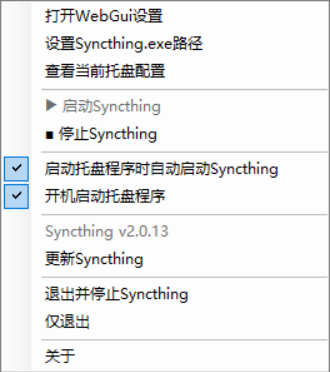

## syncthing辅助托盘
- 简单辅助管理syncthing
- 需要.net4.8.1
- 仅500kb
- 主要自用和给朋友使用
## 使用方法
- 下载syncthing https://github.com/syncthing/syncthing/releases
- 建议使用绿色版syncthing-windows-amd64-vx.x.x.zip
- 解压绿色版
- 将本工具复制到syncthing.exe同目录下
- 双击运行本工具即可

## 截图

